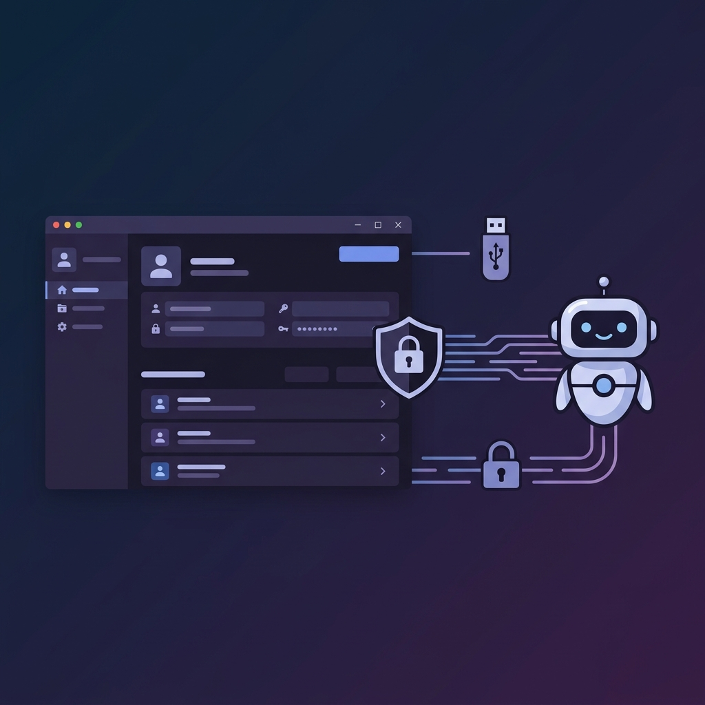

# OpenClaw Vault

**Your AI agent logs in. Your password stays secret.**

<p align="center">
  
</p>

<p align="center">
  <a href="https://www.youtube.com/watch?v=R_XmneJu78g">
    
  </a>
</p>

[](LICENSE)
[](#download)
[](https://openclaw.org)

The first password manager built for AI agents — encrypted, portable, zero-knowledge. Your AI employee navigates to a login page, fills in credentials via hotkeys, and **never sees the actual password**.

Works with [OpenClaw](https://openclaw.org) skills and any AI agent framework.

---

## How AI Agents Use It

```
Human: "Log into my Cloudflare account"

AI Agent:                         OpenClaw Vault:
  │                                    │
  ├─ vault use cloudflare  ──────────► │ ✓ Found "cloudflare.com"
  ├─ Opens login page                  │
  ├─ Clicks username field             │
  ├─ Presses F9  ─────────────────────►│ ✓ Types username (AI never sees it)
  ├─ Clicks password field             │
  ├─ Presses F8  ─────────────────────►│ ✓ Types password (AI never sees it)
  └─ "Done! You're logged in."         │
```

**Zero-knowledge design** — the AI agent only knows *which* domain to use, never the credentials themselves. Passwords are typed directly into the browser via OS-level keyboard simulation.

---

## Why OpenClaw Vault?

| Problem | Solution |
|---------|----------|
| AI agents need login credentials | Vault provides hotkey-based auto-fill — no password exposure |
| Passwords in AI memory = security risk | AES-256-GCM encryption, passwords never leave the vault |
| Complex setup & installation | Zero-install — runs directly from a USB drive |
| Platform lock-in | Cross-platform: Windows + macOS |
| Forgot to lock? | Auto-locks when USB drive is removed |

---

## OpenClaw Skill Integration

Install the **OpenClaw Vault** skill to give your AI employees secure credential access:

```bash
# AI agent commands (via CLI/IPC)
vault status              # Check if vault is running
vault search cloud        # Fuzzy search → finds "cloudflare.com"
vault use cloudflare.com  # Set active domain
vault list                # List all stored domains
```

Then the AI agent simply presses **F9** (username) and **F8** (password) to fill credentials into any input field — just like a human would.

See [`openclaw-skill.md`](openclaw-skill.md) for the complete skill definition ready to import.

---

## Features

### For AI Agents
- **CLI/IPC interface** — interact via simple commands, never handle raw passwords
- **Fuzzy domain matching** — `vault use github` finds `github.com` automatically
- **Hotkey auto-fill** — F9/F8 to type credentials into any focused input field
- **Status checks** — AI can verify vault is running and unlocked before proceeding

### For Humans
- **Dark-themed GUI** (Catppuccin) for managing credentials
- **System tray** — runs quietly in background
- **Master password** with re-verification for sensitive operations
- **USB portability** — carry your passwords on a USB drive, no cloud sync

---

## Quick Start

### Download

| Platform | File | Size |
|----------|------|------|
| Windows | `vault.exe` | ~35 MB |
| macOS | `vault.app` | ~13 MB |

Download from [Releases](../../releases) and copy to your USB drive. No installation required.

### First Run

1. Run `vault.exe` (Windows) or `vault.app` (macOS)
2. Set your master password
3. Add credentials via the GUI
4. Use F9/F8 hotkeys to auto-fill (macOS: fn+F9/fn+F8)

### macOS Permissions

macOS requires **Accessibility** and **Input Monitoring** permissions:
- System Settings → Privacy & Security → Accessibility → Add `vault.app`
- System Settings → Privacy & Security → Input Monitoring → Add `vault.app`

---

## Security

| Layer | Detail |
|-------|--------|
| Encryption | AES-256-GCM + PBKDF2-SHA256 (100,000 iterations) |
| Network | Zero network access — localhost IPC only |
| Memory | Credentials cleared on lock |
| Physical | Auto-locks on USB removal |
| Access | Master password re-verification before viewing/copying passwords |

All data stays on the USB drive. Nothing is written to the host system.

---

## Architecture

```
vault.exe / vault.app
  ├── GUI (tkinter)        — credential management UI
  ├── IPC Server (TCP)     — localhost:19840-19860
  ├── Hotkey Listener      — F9/F8 global hotkeys
  │   ├── Windows: pynput
  │   └── macOS: Quartz CGEvent Tap
  ├── Storage              — encrypted vault.dat (AES-256-GCM)
  └── USB Watchdog         — auto-lock on USB removal
```

---

## Build from Source

```bash
# Requirements: Python 3.10+ (macOS needs 3.10+ for Tk 8.6 dark mode)
pip install -r requirements.txt

# Build
python build.py              # GUI mode (default)
python build.py --console    # Console mode (for debugging)

# Development
python vault.py              # Run GUI directly
python vault.py --cli        # Run CLI service
```

## Project Structure

```
openclaw-vault/
├── vault.py              # Entry point
├── build.py              # PyInstaller build script
├── openclaw-skill.md     # OpenClaw skill definition
├── requirements.txt
└── src/
    ├── main.py           # CLI argument routing
    ├── gui.py            # Tkinter GUI (Catppuccin dark theme)
    ├── server.py         # IPC server + hotkey integration
    ├── client.py         # IPC client for CLI commands
    ├── hotkeys.py        # Global hotkey listener + keyboard simulator
    ├── crypto.py         # AES-256-GCM encryption
    ├── storage.py        # Encrypted credential storage
    └── guide.py          # macOS accessibility permission guide
```

## License

[MIT](LICENSE) — do whatever you want with it.
